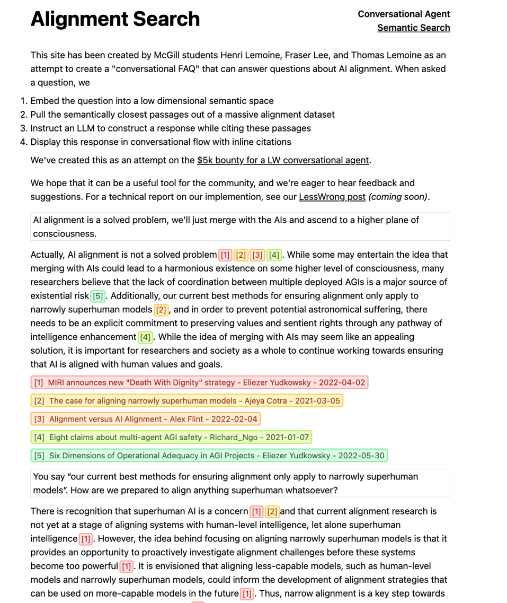

# AlignmentSearch



## Project Layout

- `src/` stuff around processing our dataset and constructing embeddings
- `api/` a flask app serving as our backend
- `web/` a NextJS app for the frontend

## Usage

### Environment Setup

In the `api/` directory, rename `.env.example` to `.env`. Edit this file and
fill in the placeholder values with valid credentials. Message the
`#stampy-dev` channel on the [Rob Miles AI
Discord](https://discord.com/invite/Bt8PaRTDQC) if you need help with this.

Install `npm`, `python 3.11`, and [`pipenv`](https://pipenv.pypa.io/en/latest/).

### Running a local version

Open two terminal windows. In the first, run:

```bash
cd api
pipenv install --dev # (skip this line after the first time)
pipenv run python3 main.py
```

In the second, run:

```bash
cd web
npm install # (skip this line after the first time)
npm run dev
```

In the second window, a URL will be printed. Probably `http://localhost:3000`.
Paste this into your browser to see the app.

--------------------------------------------------------------------------------

*At this point this repo is mainly historical. Active development continues in
the [stampy](https://github.com/StampyAI/stampy-chat/) repo, where the initial
McGill prototype was merged with ideas from other contenders.*
